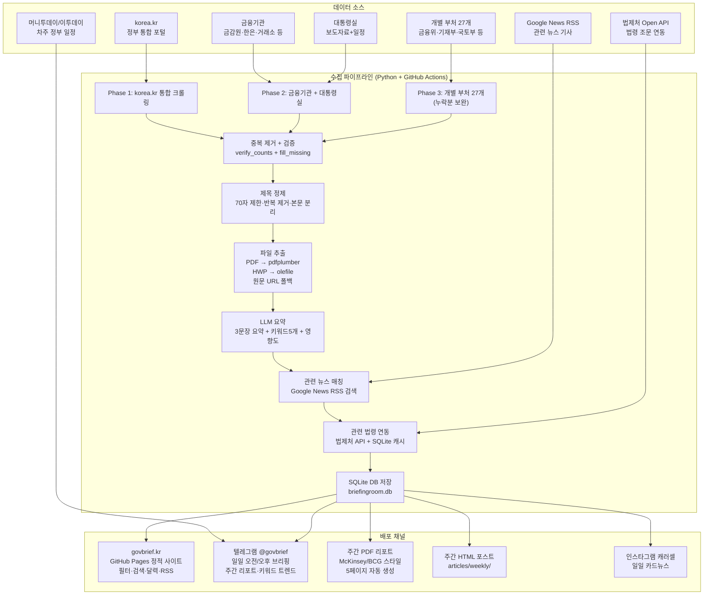
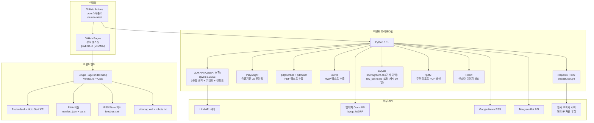
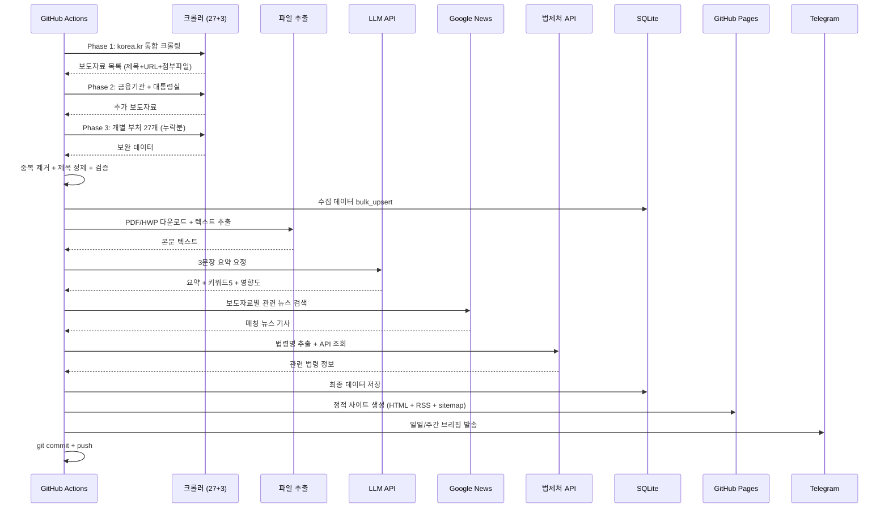
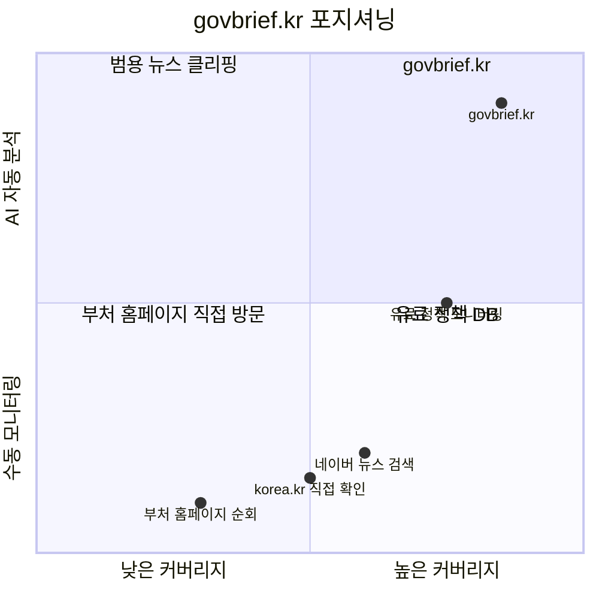

# govbrief.kr 서비스 구조도 & 영업 설득 논리

---

## 1. 서비스 전체 데이터 흐름도

---

## 2. 운영 스케줄

```mermaid
gantt
    title govbrief.kr 주간 운영 스케줄
    dateFormat HH:mm
    axisFormat %H:%M

    section 월~금
    오전 크롤링 (KST 11:40)       :a1, 11:40, 60min
    오후 크롤링 (KST 18:00)       :a2, 18:00, 60min

    section 토요일
    주간요약 생성 (KST 09:00)     :a3, 09:00, 120min

    section 일요일
    차주 정부 일정 (KST 17:00)    :a4, 17:00, 30min
```

| 요일 | 시간(KST) | 작업 | 결과물 |
|------|-----------|------|--------|
| 월~금 | 11:40 | 오전 보도자료 수집 | 일일 브리핑 (텔레그램 + 웹) |
| 월~금 | 18:00 | 오후 보도자료 수집 | 일일 브리핑 (텔레그램 + 웹) |
| 토 | 09:00 | 주간 분석 + PDF 생성 | 주간 리포트 (PDF + HTML + 텔레그램) |
| 일 | 17:00 | 차주 정부 일정 크롤링 | 일정 알림 (텔레그램 + HTML) |

---

## 3. 기능 구조도

```mermaid
flowchart LR
    subgraph Categories["5개 분야 분류"]
        F1["금융경제<br/>금융위·금감원·기재부·한은<br/>공정위·산자부 등"]
        F2["사회복지<br/>복지부·교육부·고용부<br/>법무부·권익위 등"]
        F3["산업기술<br/>과기부·국토부·해수부<br/>농식품부·환경부 등"]
        F4["외교안보<br/>대통령실·외교부<br/>통일부·국방부"]
        F5["행정법제<br/>행안부·법제처<br/>인사처·국조실"]
    end

    subgraph Content["콘텐츠 유형"]
        CT1["일일 브리핑<br/>오전/오후 2회<br/>분야별 대표 1~3건"]
        CT2["주간 리포트<br/>5페이지 PDF<br/>키워드 트렌드·미디어 임팩트"]
        CT3["차주 일정<br/>대통령실 + 부처 주요 일정"]
        CT4["법령 연동<br/>보도자료 ↔ 법제처 API<br/>관련 조문 자동 링크"]
        CT5["뉴스 매칭<br/>Google News RSS<br/>주요 언론사 보도 연결"]
    end

    subgraph UI["사용자 인터페이스"]
        U1["웹사이트 govbrief.kr<br/>분야 필터 · 키워드 검색<br/>달력 시트 · RSS 피드<br/>개별 기사 상세 페이지"]
        U2["텔레그램 @govbrief<br/>분야별 인라인 버튼<br/>제목 링크화 · 뉴스 링크"]
        U3["주간 PDF<br/>다운로드 · 공유"]
        U4["인스타그램<br/>캐러셀 카드뉴스"]
    end

    Categories --> Content
    Content --> UI
```

---

## 4. 기술 스택 구조도

---

## 5. 파이프라인 상세 흐름

---

---

# 국내 영업 설득 논리: 타겟 고객 5개 세그먼트

---

## 1. 금융사 컴플라이언스팀

### 현재 Pain Point
- 금융위, 금감원, 한은, 공정위 등 10개 이상 기관 사이트를 매일 수동 순회
- 신규 규제/가이드라인 발표를 놓치면 과태료 또는 제재 리스크
- 보도자료 원문이 PDF/HWP로만 제공되어 검색, 아카이빙이 불가능
- 주요 규제 변경 시 관련 법령 조문을 별도로 법제처에서 직접 조회
- 컴플라이언스 담당 1인이 하루 1~2시간을 모니터링에 소비

### govbrief 솔루션
- **27개 부처 + 금융기관 16곳**을 자동 크롤링하여 하루 2회 푸시 알림
- **금융경제 분야 6개 서브카테고리** (금융정책, 감독규제, 시장통화, 금융인프라, 정책금융, 업계동향) 세분화 필터
- **법제처 API 자동 연동**: 보도자료에서 언급된 법령명을 자동 추출하여 법령 전문 링크 제공
- **AI 3문장 요약 + 영향도(상/중/하) 자동 분류**: "상" 등급 = 법령 제개정, 금리 변경, 대규모 규제 변경
- **관련 뉴스 자동 매칭**: 언론의 해석과 시장 반응을 함께 파악

### 구체적 ROI
| 항목 | Before | After |
|------|--------|-------|
| 일일 모니터링 시간 | 1.5~2시간 | 10~15분 |
| 커버 기관 수 | 핵심 5~7곳 | 51곳 전수 |
| 규제 이슈 인지 지연 | 1~3일 | 당일 (오전/오후) |
| 법령 조문 확인 | 수동 법제처 검색 | 자동 링크 제공 |
| 연간 시간 절감 | - | **약 350시간 (1인 기준)** |

### 실제 시나리오
> 금요일 오후 6시, 금융위원회가 "가상자산이용자보호법 시행령 개정안"을 발표했다. govbrief는 18:00 오후 브리핑에서 이를 영향도 "상"으로 분류하고, 3문장 요약과 함께 가상자산이용자보호법 해당 조문 링크를 텔레그램으로 즉시 전송한다. 컴플라이언스 팀장은 퇴근 후 텔레그램 알림으로 확인하고, 월요일 아침 회의에서 바로 대응 방안을 논의할 수 있다.

---

## 2. 로펌 / 법무팀

### 현재 Pain Point
- 소속 변호사가 담당 산업별로 관련 부처 동향을 각자 수동 추적
- 법령 제개정 예고와 보도자료 사이의 연결 고리를 놓치기 쉬움
- 고객사(기업)에 정책 변화를 선제적으로 안내해야 하지만, 정보 입수가 늦어 후행적 대응에 그침
- 주간 뉴스레터나 클라이언트 리포트 작성에 시간이 많이 소요됨

### govbrief 솔루션
- **5개 분야별 자동 분류**: 담당 분야만 필터링하여 즉시 확인
- **법제처 API 연동**: 보도자료에서 인용된 법령 + 조문번호까지 자동 추출 및 링크
- **주간 PDF 리포트**: McKinsey/BCG 스타일 5페이지 분석 리포트를 자동 생성하여 클라이언트에 그대로 전달 가능
- **키워드 트렌드**: 주간 키워드 급상승/하락으로 정책 방향 예측
- **RSS 피드**: 사내 지식 관리 시스템(KMS)에 자동 연동 가능

### 구체적 ROI
| 항목 | Before | After |
|------|--------|-------|
| 정책 모니터링 | 변호사 개인별 수동 | 팀 단위 자동 모니터링 |
| 고객 선제 안내 | 언론 보도 후 인지 (1~3일) | 보도자료 당일 인지 |
| 주간 리포트 작성 | 3~5시간/주 | 자동 PDF 그대로 활용 |
| 법령 조문 확인 | 법제처 수동 검색 | 자동 링크 1클릭 |
| 연간 절감 | - | **변호사 1인 기준 200시간+** |

### 실제 시나리오
> 대형 로펌 TMT(기술미디어통신) 팀 소속 변호사가 "산업기술" 분야만 텔레그램으로 수신한다. 수요일 오전 과기부의 "AI 기본법 시행령 입법예고" 보도자료가 영향도 "상"으로 분류되어 즉시 수신된다. 법제처 API 연동으로 AI기본법 조문 링크가 함께 제공되고, 변호사는 당일 오후에 AI 스타트업 고객사 3곳에 선제적 법률 의견서를 발송한다.

---

## 3. 정책 기자 / 언론인

### 현재 Pain Point
- 출입처(부처) 보도자료만 집중 확인하고, 타 부처 보도자료는 놓침
- 여러 부처가 동시에 발표하는 관련 정책의 맥락 파악이 어려움
- 정부 보도자료 발표 후 1시간 내 기사 작성 경쟁 → 요약과 키워드 파악 시간이 부족
- 보도자료 첨부 PDF를 열어 핵심 수치를 찾는 데 시간 소요

### govbrief 솔루션
- **51개 기관 전수 수집**: 출입처 외 부처의 보도자료까지 한 곳에서 확인
- **AI 요약 3문장**: "핵심 정책 / 주요 수치+시행 시점 / 대상+효과" 순서로 기사 리드 초안에 즉시 활용
- **영향도 상/중/하 자동 분류**: "상" 등급만 필터링하면 당일 톱 기사 후보 즉시 파악
- **관련 뉴스 자동 매칭**: 타 언론사의 기존 보도와 비교 가능
- **키워드 5개 자동 태깅**: 기사 태그 및 검색 최적화에 활용

### 구체적 ROI
| 항목 | Before | After |
|------|--------|-------|
| 보도자료 확인 범위 | 출입처 1~3곳 | 51곳 전수 |
| 기사 초안 작성 시간 | 30~60분 | 10~15분 (AI 요약 활용) |
| "범부처 연결 기사" 발굴 | 우연에 의존 | 키워드+분야 필터로 체계적 발굴 |
| 주말 차주 일정 확인 | 월요일 아침 수동 확인 | 일요일 오후 자동 수신 |

### 실제 시나리오
> 경제부 기자가 수요일 오전 브리핑에서 기재부의 "세법 개정안" (영향도 상)과 국세청의 "세무조사 운영개선 방안" (영향도 중)이 같은 날 발표된 것을 확인한다. 두 건의 AI 요약과 키워드를 비교하여 "세법 개정안에 맞춘 국세청 집행 전략 변화"라는 연결 기사를 경쟁사보다 먼저 작성한다.

---

## 4. 정부 관계(GR) 담당자

### 현재 Pain Point
- 기업에 영향을 미치는 부처 동향을 뒤늦게 파악하여 대응 시점을 놓침
- 규제 예고 → 입법 → 시행 흐름을 장기 추적하기 어려움
- 여러 부처에 걸친 정책(예: 그린뉴딜 = 산자부+환경부+기재부)의 전체 그림 파악 불가
- 경영진에게 정기적으로 "정부 동향 보고서"를 작성해야 하는데, 매주 반나절 소요

### govbrief 솔루션
- **키워드 검색 + 분야 필터**: 자사 관련 키워드(예: "탄소중립", "반도체", "AI")로 즉시 필터링
- **주간 리포트 자동 생성**: 5페이지 PDF를 경영진 보고서로 그대로 활용 가능
- **키워드 트렌드 분석**: 특정 정책 키워드의 주간 빈도 변화로 정부 관심도 추이 파악
- **부처 활동 랭킹**: 어느 부처가 활발히 움직이는지 정량적으로 파악
- **달력 뷰**: 과거 보도자료 아카이브로 정책 흐름 장기 추적

### 구체적 ROI
| 항목 | Before | After |
|------|--------|-------|
| 정부 동향 보고서 작성 | 4~5시간/주 | 주간 PDF 자동 생성 (0시간) |
| 정책 인지 속도 | 언론 보도 경유 (1~2일) | 보도자료 당일 (오전/오후) |
| 커버 부처 수 | 핵심 3~5곳 | 51곳 전수 |
| 정책 트렌드 파악 | 감(感)에 의존 | 키워드 빈도 데이터 기반 |
| 연간 절감 | - | **보고서 작성만 약 230시간** |

### 실제 시나리오
> 대기업 GR팀장이 매주 토요일 아침에 자동 수신되는 주간 리포트 PDF를 경영진 브리핑에 첨부한다. "이번 주 산업기술 분야 82건 발표, 키워드 '#반도체' 신규 급상승, 산자부와 과기부에서 동시 정책 발표"라는 분석이 자동 포함되어, 월요일 경영 회의에서 반도체 관련 GR 전략을 즉시 논의한다.

---

## 5. 스타트업 / 중소기업 대표

### 현재 Pain Point
- 정부 지원사업(보조금, R&D, 인력 지원) 공고를 늦게 발견하여 신청 마감을 놓침
- 중기부, 과기부, 산자부 등 여러 부처의 지원사업을 일일이 확인할 여력이 없음
- 보도자료 제목만 보고는 자사 해당 여부를 판단하기 어려움 (PDF 첨부를 일일이 열어봐야 함)
- 규제 변화(개인정보보호법, 전자상거래법 등)를 모르고 사업 운영하다가 불이익
- "정부 정책 모니터링 서비스"를 구독하면 월 수십만 원 ~ 수백만 원

### govbrief 솔루션
- **AI 3문장 요약**: PDF를 열지 않아도 "대상"과 "지원 내용"을 즉시 파악
- **영향도 "상" 필터**: 대규모 예산 투입, 신규 제도 신설 등 꼭 봐야 할 것만 선별
- **텔레그램 무료 수신**: 별도 앱 설치 없이 텔레그램만으로 매일 핵심 브리핑 수신
- **키워드 검색**: "스타트업", "중소기업", "R&D", "바우처" 등으로 즉시 필터링
- **관련 법령 링크**: 지원사업 근거 법령을 바로 확인하여 자격 요건 검토

### 구체적 ROI
| 항목 | Before | After |
|------|--------|-------|
| 지원사업 발견 | 지인 소개 또는 우연히 | 발표 당일 텔레그램 수신 |
| 정책 모니터링 비용 | 유료 서비스 월 30~100만 원 | 무료 (텔레그램 + 웹) |
| 보도자료 검토 시간 | 주 2~3시간 | 주 20~30분 |
| 규제 변화 인지 | 사후 인지 (피해 발생 후) | 사전 인지 (대응 가능) |
| 지원사업 신청률 | 연 1~2건 | 연 5건 이상 (적격 사업 모두 포착) |

### 실제 시나리오
> AI 스타트업 대표가 화요일 오전 텔레그램에서 중기부의 "AI 활용 중소기업 디지털 전환 지원사업 공모" (영향도 상, 예산 2,000억)를 확인한다. AI 요약에서 "종업원 50인 이하 중소기업 대상, 기업당 최대 1억 원, 6월 30일 마감"이라는 핵심 정보를 즉시 파악하고, 관련 중소기업진흥법 조문 링크로 자격 요건을 확인한 뒤, 마감 3주 전에 여유있게 신청서를 준비한다.

---

## 경쟁 우위 요약

| 차별점 | govbrief.kr | 유료 정책 DB | 직접 모니터링 |
|--------|-------------|-------------|--------------|
| 커버리지 | 51개 기관 자동 | 선별적 | 인력 한계 |
| AI 요약 | 3문장 + 키워드 + 영향도 | 원문 그대로 | 수동 정리 |
| 법령 연동 | 법제처 API 자동 | 일부 수동 | 없음 |
| 뉴스 매칭 | Google News 자동 | 별도 서비스 | 없음 |
| 주간 리포트 | PDF 자동 생성 | 유료 추가 | 직접 작성 |
| 배포 채널 | 웹 + 텔레그램 + PDF + RSS | 웹 전용 | - |
| 비용 | 무료 (현재) | 월 30~500만 원 | 인건비 |
| 업데이트 주기 | 하루 2회 (오전/오후) | 1일 1회 | 부정기 |

---

## 핵심 수치 (2026년 3월 기준)

- 수집 기관: **51개** (정부 부처 27개 + 금융기관 16개 + 대통령실 + korea.kr + 머니투데이 등)
- 일일 평균 수집: **80~150건** 보도자료
- 크롤러 수: **30개** (개별 크롤러 27개 + korea.kr + 금융통합 + 대통령실)
- 분류 체계: **5개 분야** + 금융경제 **6개 서브카테고리**
- LLM 요약: **3문장** + 키워드 5개 + 영향도 3단계
- 배포 채널: **4개** (웹사이트 + 텔레그램 + PDF + 인스타그램)
- 운영 비용: GitHub Actions 무료 티어 + LLM API 비용만
