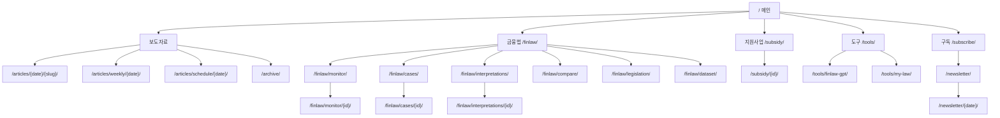
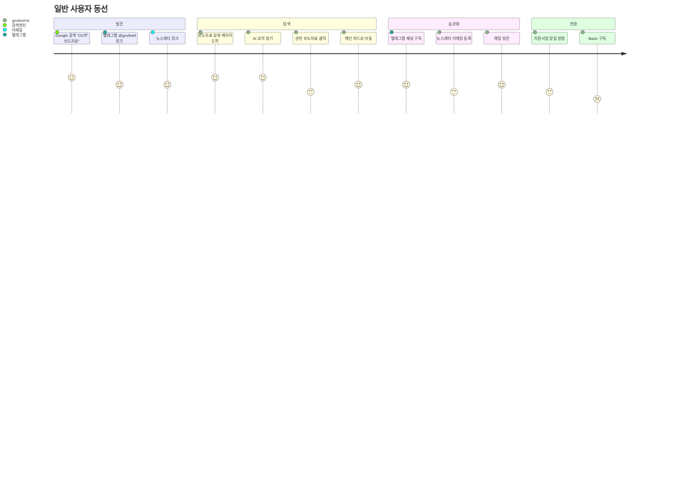
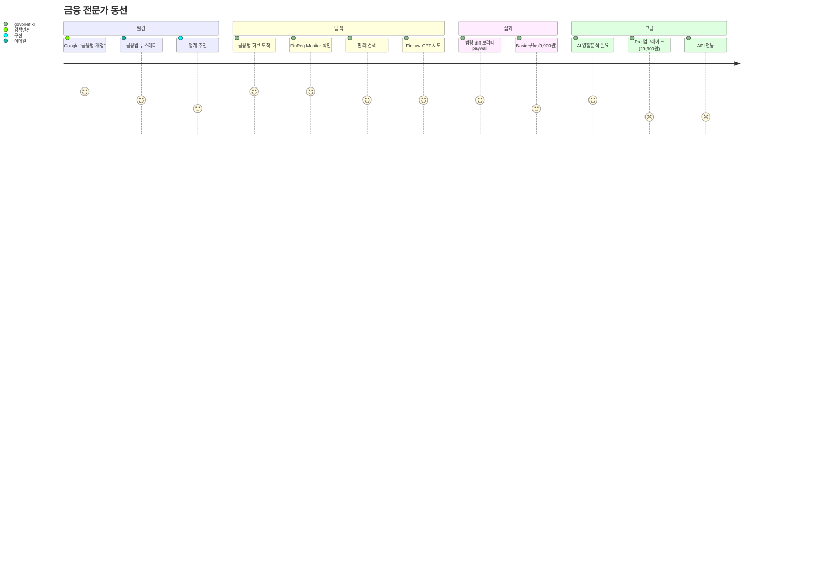
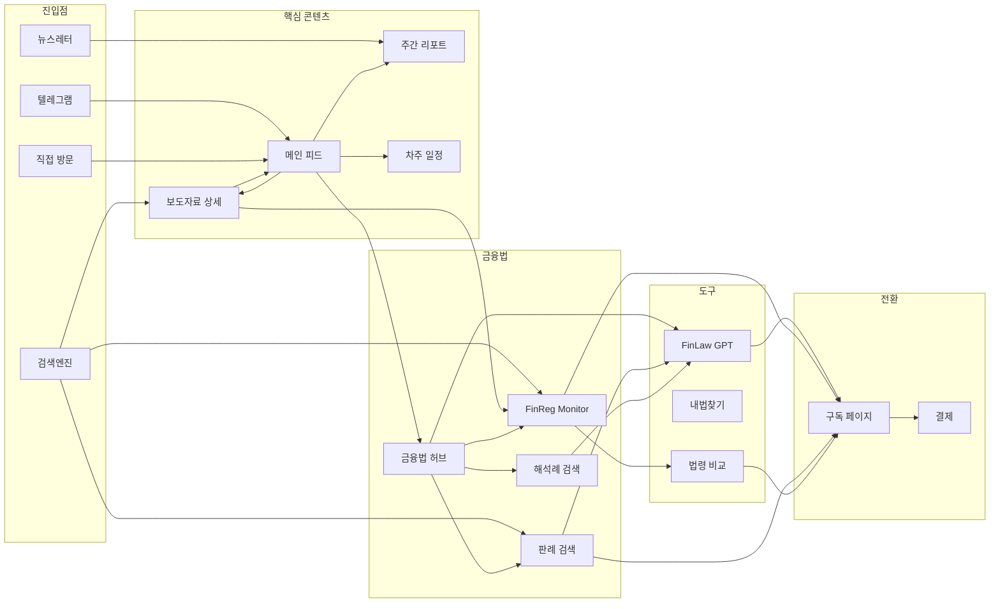
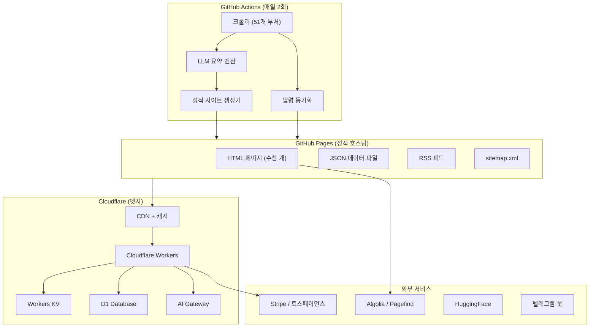
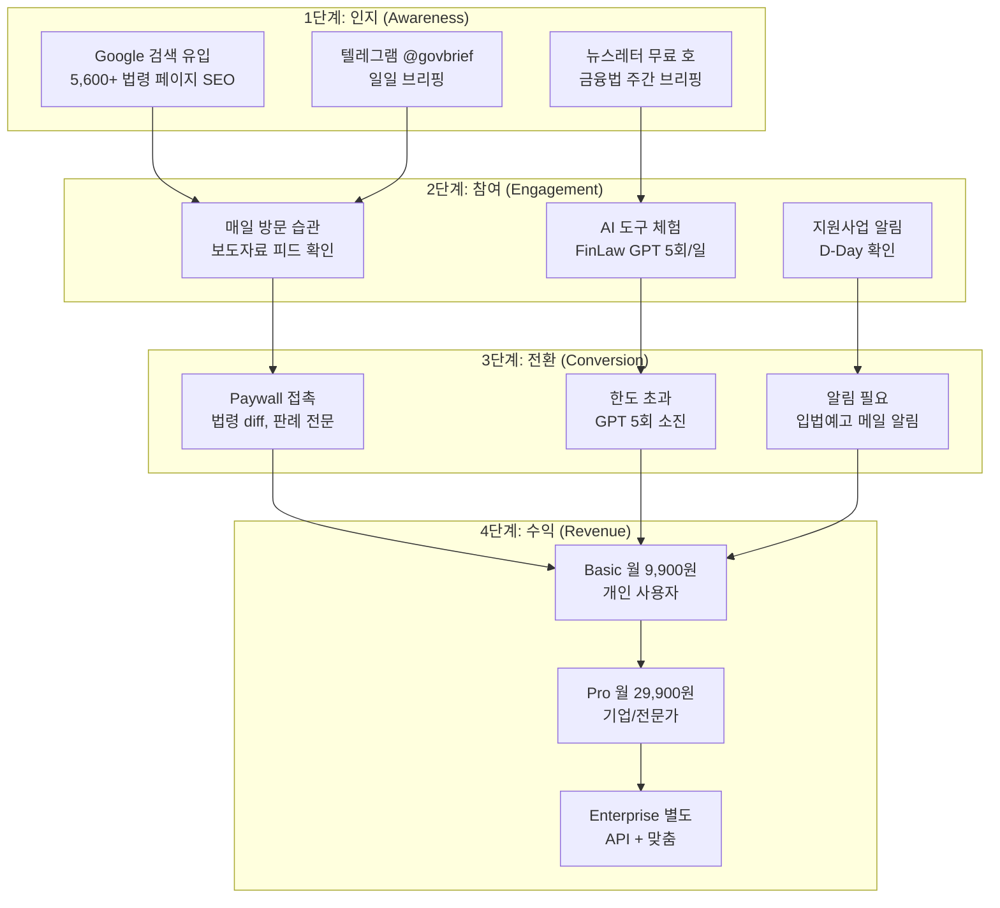
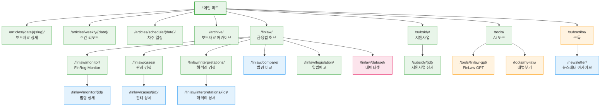

# govbrief.kr 통합 사이트 아키텍처 설계서

> 작성일: 2026-03-31
> 버전: 1.0
> 범위: 보도자료 + 금융법 + 지원사업 + AI 도구를 하나의 govbrief.kr로 통합

---

## 1. 설계 원칙

| 원칙 | 설명 |
|------|------|
| **정적 우선** | GitHub Pages 기반. 동적 기능은 외부 API + 클라이언트 JS로 해결 |
| **데이터 중심** | 5,600+ 법령 데이터, 일 150건 보도자료가 핵심 자산. 데이터가 페이지를 만든다 |
| **점진적 공개** | 무료 콘텐츠로 유입 -> 전문 도구로 전환 -> 유료 구독으로 수익화 |
| **두 트랙 분리** | "정책 브리핑" (일반인/공무원) vs "금융법" (금융 전문가) 동선 분리 |
| **SEO 극대화** | 5,600건 법령 + 1,275건 보도자료 = 정적 HTML 페이지로 검색 유입 극대화 |

---

## 2. 정보 구조 (Information Architecture)

### 2.1 메인 네비게이션 (탑바)

```
[브리핑룸 로고]  메인 | 금융법 | 지원사업 | 도구 | 구독
```

| 메뉴 | 대상 | 콘텐츠 |
|------|------|--------|
| **메인** | 모든 방문자 | 일일 보도자료 피드 (현재 `/`) |
| **금융법** | 금융 전문가 | FinReg Monitor + 판례 + 해석례 + 법령 비교 |
| **지원사업** | 기업/창업자 | 중기부 + K-Startup + NTIS 통합 (현재 `/subsidy/`) |
| **도구** | 전문 사용자 | FinLaw GPT, 내법찾기, 법령 비교 도구 |
| **구독** | 전환 대상 | 뉴스레터 가입 + 유료 플랜 안내 |

### 2.2 URL 체계

```
govbrief.kr/
├── /                                    # 메인: 일일 보도자료 피드
├── /articles/{date}/{slug}/             # 보도자료 상세 (기존 유지)
├── /articles/weekly/{date}/             # 주간 리포트 (기존 유지)
├── /articles/schedule/{date}/           # 차주 일정 (기존 유지)
├── /archive/                            # 보도자료 아카이브 (날짜/부처별)
│
├── /finlaw/                             # 금융법 허브 (랜딩)
├── /finlaw/monitor/                     # FinReg Monitor 대시보드
├── /finlaw/monitor/{law-id}/            # 개별 법령 모니터링 상세
├── /finlaw/cases/                       # 판례 목록
├── /finlaw/cases/{case-id}/             # 판례 상세
├── /finlaw/interpretations/             # 해석례 목록
├── /finlaw/interpretations/{id}/        # 해석례 상세
├── /finlaw/compare/                     # 법령 비교 도구
├── /finlaw/legislation/                 # 입법예고 모니터링
├── /finlaw/dataset/                     # HuggingFace 데이터셋 안내
│
├── /subsidy/                            # 지원사업 목록 (기존 유지)
├── /subsidy/{id}/                       # 지원사업 상세 (신규)
│
├── /tools/                              # AI 도구 허브
├── /tools/finlaw-gpt/                   # FinLaw GPT 챗봇
├── /tools/my-law/                       # 내법찾기 (일반인용)
│
├── /subscribe/                          # 구독/결제 페이지
├── /newsletter/                         # 뉴스레터 아카이브
├── /newsletter/{date}/                  # 뉴스레터 개별 호
│
├── /about/                              # 서비스 소개
├── /api/                                # API 문서 (향후)
├── /feed/rss.xml                        # RSS (기존 유지)
└── /sitemap.xml                         # 사이트맵 (기존 유지)
```

### 2.3 페이지 계층 구조



---

## 3. 서비스 그룹핑

### 3.1 세 개의 기둥 (Three Pillars)

```
                    govbrief.kr
                        |
         +--------------+--------------+
         |              |              |
    [정책 브리핑]   [금융법 전문]    [실용 도구]

    - 일일 보도자료    - FinReg Monitor  - FinLaw GPT
    - 주간 리포트      - 판례 검색       - 내법찾기
    - 차주 일정        - 해석례 검색     - 법령 비교
    - 지원사업         - 입법예고 알림   - PolicyLaw Bridge
    - 뉴스레터         - 금융법 데이터셋
```

### 3.2 그룹핑 근거

| 그룹 | 핵심 사용자 | 진입 동기 | 업데이트 주기 |
|------|------------|-----------|--------------|
| **정책 브리핑** | 공무원, 기자, 일반 시민 | "오늘 정부가 뭘 했지?" | 매일 2회 |
| **금융법 전문** | 금융사 컴플라이언스, 법률가, 핀테크 | "이 법 바뀌면 우리에게 영향 있나?" | 법령 개정 시 |
| **실용 도구** | 모든 사용자 | "이 법 조항 빨리 찾고 싶다" | 상시 (대화형) |

### 3.3 무료/유료 경계선

```mermaid
graph LR
    subgraph FREE["무료 (Free Tier)"]
        F1["일일 보도자료 피드"]
        F2["보도자료 AI 요약"]
        F3["주간 리포트"]
        F4["차주 일정"]
        F5["지원사업 목록"]
        F6["금융법 뉴스레터 (최근 1호)"]
        F7["법령 목록 열람"]
        F8["판례/해석례 목록"]
        F9["내법찾기 (일 3회)"]
        F10["FinLaw GPT (일 5회)"]
    end

    subgraph BASIC["Basic (월 9,900원)"]
        B1["뉴스레터 전체 아카이브"]
        B2["법령 개정 diff 열람"]
        B3["입법예고 알림 (이메일)"]
        B4["FinLaw GPT (일 30회)"]
        B5["내법찾기 무제한"]
        B6["판례/해석례 전문 열람"]
    end

    subgraph PRO["Pro (월 29,900원)"]
        P1["FinReg Monitor 풀 대시보드"]
        P2["AI 영향 분석 리포트"]
        P3["법령 비교 도구 무제한"]
        P4["FinLaw GPT 무제한"]
        P5["API 접근 (월 10,000 콜)"]
        P6["맞춤 알림 (법령+부처 조합)"]
        P7["HuggingFace 데이터셋 접근"]
    end

    FREE --> BASIC
    BASIC --> PRO
```



---

## 4. 페이지별 상세 설계

### 4.1 메인 페이지 (`/`)

**역할**: 일일 보도자료 피드 + 사이트 전체 진입점

| 섹션 | 컴포넌트 | 설명 |
|------|---------|------|
| 히어로 | 오늘의 숫자 카드 | "오늘 132건 수집, 51개 부처" |
| 분야 탭 | 5개 분야 필터 | 금융경제 / 사회복지 / 산업기술 / 외교안보 / 행정법제 |
| 피드 | 보도자료 카드 리스트 | 제목 + 기관 + AI 요약 1줄 + 키워드 태그 |
| 사이드바 (데스크톱) | 크로스 링크 패널 | 주간 리포트 / 차주 일정 / 지원사업 / 금융법 배너 |
| CTA 배너 | 뉴스레터 구독 폼 | "매일 아침 5분 정책 브리핑" 이메일 수집 |
| 하단 | 텔레그램 채널 링크 | @govbrief 채널 가입 유도 |

### 4.2 보도자료 상세 (`/articles/{date}/{slug}/`)

**역할**: SEO 랜딩 + AI 분석 제공 (기존 유지 + 강화)

| 섹션 | 현재 | 추가 |
|------|------|------|
| AI 요약 | O | 유지 |
| 왜 중요한가 | O | 유지 |
| 실무 영향 | O | 유지 |
| 관련 법령 | O | `/finlaw/monitor/{id}/`로 링크 강화 |
| 관련 뉴스 | O (WP만) | 정적 HTML에도 포함 |
| **관련 보도자료** | X | 같은 키워드/부처의 다른 보도자료 3건 |
| **PolicyLaw Bridge** | X | "이 보도자료와 관련된 법령 변화" 타임라인 |

### 4.3 금융법 허브 (`/finlaw/`)

**역할**: 금융법 전문 서비스의 랜딩 페이지

| 섹션 | 설명 |
|------|------|
| 히어로 | "139개 금융법령, AI가 모니터링합니다" |
| 최근 개정 | 최근 30일 내 개정된 법령 카드 5개 |
| 입법예고 | 현재 진행 중인 입법예고 리스트 |
| 통계 대시보드 | 법령 139 / 조문 3,893 / 판례 526 / 해석례 193 |
| 서비스 카드 | Monitor / 판례 / 해석례 / 비교 도구 / GPT |
| 뉴스레터 CTA | "주간 금융법 변화 5분 브리핑" 구독 폼 |

### 4.4 FinReg Monitor (`/finlaw/monitor/`)

**역할**: 139개 금융법 개정 현황 대시보드

| 섹션 | 무료 | Basic | Pro |
|------|------|-------|-----|
| 법령 목록 (이름, 최종 개정일) | O | O | O |
| 개정 이력 타임라인 | 최근 3건 | 전체 | 전체 |
| 신구조문 diff | X | O | O |
| AI 영향 분석 | X | X | O |
| 맞춤 알림 설정 | X | X | O |

### 4.5 판례/해석례 검색 (`/finlaw/cases/`, `/finlaw/interpretations/`)

**역할**: 금융 판례 526건 + 해석례 193건 검색

| 기능 | 무료 | Basic |
|------|------|-------|
| 목록 검색 (제목, 법원, 날짜) | O | O |
| 요약 (AI 생성) | O | O |
| 전문 열람 | 처음 500자 | 전문 |
| 관련 법령 연동 | O | O |

### 4.6 지원사업 (`/subsidy/`)

**역할**: 정부 지원사업 통합 (기존 유지 + 강화)

| 추가 | 설명 |
|------|------|
| 개별 상세 페이지 | `/subsidy/{id}/` -- AI 요약 + 신청 가이드 |
| D-Day 필터 | 마감 임박순 정렬 |
| 카테고리 필터 | R&D / 사업화 / 정책자금 / 글로벌 / 인력 |
| 알림 설정 | 관심 분야 새 공고 이메일 알림 (Basic+) |

### 4.7 AI 도구 페이지 (`/tools/`)

**역할**: 대화형 AI 도구 허브

| 도구 | 대상 | 기술 | 무료 한도 |
|------|------|------|-----------|
| **FinLaw GPT** | 금융 전문가 | RAG + Cloudflare Workers | 일 5회 |
| **내법찾기** | 일반인 | 텔레그램 봇 + 웹 버전 | 일 3회 |
| **법령 비교** | 법률가 | 정적 diff + JS | 일 3회 |

### 4.8 구독/결제 (`/subscribe/`)

**역할**: 유료 전환 + 뉴스레터 가입

| 섹션 | 설명 |
|------|------|
| 플랜 비교표 | Free / Basic / Pro 기능 비교 |
| 뉴스레터 미리보기 | 최근 호 샘플 |
| 결제 | Stripe 또는 토스페이먼츠 연동 |
| FAQ | 자주 묻는 질문 |

---

## 5. 공통 요소

### 5.1 헤더 (Header)

```
+---------------------------------------------------------------+
| [브리핑룸]    메인  금융법  지원사업  도구    [구독] [검색]     |
+---------------------------------------------------------------+
```

- 스티키 헤더 (현재 `topnav` 스타일 확장)
- 모바일: 햄버거 메뉴로 전환
- `[구독]` 버튼은 항상 accent 색상으로 강조
- `[검색]`은 Algolia DocSearch 또는 Pagefind 연동

### 5.2 푸터 (Footer)

```
+---------------------------------------------------------------+
| 브리핑룸                                                       |
|                                                                |
| 서비스          금융법          연결              법적 고지      |
| - 보도자료 피드  - FinReg Monitor - 텔레그램      - 이용약관    |
| - 주간 리포트    - 판례 검색      - 뉴스레터      - 개인정보처리 |
| - 차주 일정      - 해석례 검색    - RSS           - 면책조항    |
| - 지원사업       - 법령 비교      - API 문서                    |
|                  - FinLaw GPT                                  |
|                                                                |
| (c) 2026 govbrief.kr  |  데이터 출처: 정부 공개 API            |
+---------------------------------------------------------------+
```

### 5.3 사이드바 (데스크톱 전용, 컨텍스트 적응형)

| 현재 페이지 | 사이드바 내용 |
|------------|-------------|
| 메인 피드 | 주간 리포트 / 차주 일정 / 지원사업 / 금융법 배너 |
| 보도자료 상세 | 관련 보도자료 3건 / 관련 법령 / 구독 CTA |
| 금융법 허브 | 최근 개정 법령 / FinLaw GPT 위젯 / 뉴스레터 CTA |
| 지원사업 | 마감 임박 Top 3 / 카테고리 필터 |

---

## 6. 사용자 동선 설계

### 6.1 일반 사용자 (General User Journey)



### 6.2 금융 전문가 (Finance Expert Journey)



### 6.3 페이지 간 연결 흐름



---

## 7. 기술 설계

### 7.1 아키텍처 개요



### 7.2 정적 vs 동적 페이지 분류

| 페이지 | 유형 | 근거 |
|--------|------|------|
| 메인 피드 (`/`) | **정적 + JS 하이드레이션** | 매일 2회 빌드, JS로 필터/검색 |
| 보도자료 상세 | **정적** | 빌드 시 생성, 변경 없음 |
| 주간 리포트 | **정적** | 주 1회 생성 |
| 차주 일정 | **정적** | 주 1회 생성 |
| 보도자료 아카이브 | **정적 + JS** | 날짜/부처 필터는 클라이언트 JS |
| 금융법 허브 | **정적 + JS** | 정적 랜딩, JS로 최근 데이터 fetch |
| FinReg Monitor 목록 | **정적** | 법령 데이터 변경 시 재빌드 |
| FinReg Monitor 상세 | **정적** | 법령별 정적 페이지 (139개) |
| 판례/해석례 목록 | **정적 + JS** | 정적 목록, JS 검색 |
| 판례/해석례 상세 | **정적** | 개별 정적 페이지 (719개) |
| 법령 비교 도구 | **정적 + JS** | 두 버전 JSON 로드 후 클라이언트 diff |
| 지원사업 목록 | **정적 + JS** | 매일 재빌드, JS 필터 |
| FinLaw GPT | **동적** | Cloudflare Workers + AI Gateway |
| 내법찾기 (웹) | **동적** | Cloudflare Workers |
| 구독/결제 | **동적** | Stripe/토스 연동, Workers |
| 뉴스레터 | **정적** | 발송 후 HTML 아카이브 |

### 7.3 GitHub Pages 한계 해결 전략

| 한계 | 해결 방안 |
|------|----------|
| 서버 사이드 로직 불가 | Cloudflare Workers (무료 10만 req/day) |
| 데이터베이스 없음 | Cloudflare D1 (SQLite 호환, 무료 5GB) |
| 인증/세션 없음 | Cloudflare Workers + KV (세션 저장) |
| 실시간 검색 불가 | Pagefind (빌드 타임 인덱스, 정적 검색) 또는 Algolia (무료 10K req/mo) |
| 동적 API 불가 | Cloudflare Workers REST API |
| 결제 처리 불가 | Stripe Checkout (리다이렉트) + Workers 웹훅 |

### 7.4 Cloudflare Workers API 엔드포인트

```
api.govbrief.kr/
├── /auth/login          # 이메일 + 매직링크 로그인
├── /auth/verify         # 토큰 검증
├── /chat/finlaw         # FinLaw GPT (RAG)
├── /chat/mylaw          # 내법찾기 (일반인용)
├── /search              # 통합 검색 API
├── /subscribe           # 뉴스레터 구독
├── /billing/checkout    # Stripe 결제 세션 생성
├── /billing/webhook     # Stripe 웹훅
├── /billing/status      # 구독 상태 확인
├── /alerts/settings     # 알림 설정 CRUD
└── /alerts/webhook      # 알림 발송 트리거
```

### 7.5 데이터 흐름

```
[정부 API] --> [GitHub Actions 크롤러]
                    |
                    v
            [LLM 요약 엔진]
                    |
                    v
    +---------------+---------------+
    |               |               |
    v               v               v
[data/*.json]  [articles/*.html]  [finlaw/*.html]
    |               |               |
    v               v               v
[GitHub Pages] --> [Cloudflare CDN] --> [사용자 브라우저]
                        |
                        v
               [Cloudflare Workers]
                    |       |
                    v       v
              [D1 DB]   [AI Gateway]
```

### 7.6 빌드 파이프라인 확장

현재 `generate_static()` 함수를 확장하여 금융법 페이지도 생성.

```python
# briefingroom/static_gen.py 확장 계획

def generate_static(target_date: str) -> None:
    """정적 사이트 전체 생성"""
    generate_rss(target_date)           # 기존
    generate_article_pages(target_date) # 기존
    generate_sitemap(target_date)       # 기존 (URL 추가)
    generate_finlaw_pages()             # 신규: 금융법 139개 법령 페이지
    generate_case_pages()               # 신규: 판례 526개 페이지
    generate_interpretation_pages()     # 신규: 해석례 193개 페이지
    generate_finlaw_hub()               # 신규: 금융법 허브 랜딩
    generate_newsletter_archive()       # 신규: 뉴스레터 아카이브
    generate_search_index()             # 신규: Pagefind 인덱스
```

---

## 8. 수익화 퍼널

### 8.1 퍼널 단계



### 8.2 Paywall 배치 전략

| 위치 | Paywall 유형 | 전환 메시지 |
|------|-------------|-------------|
| 판례/해석례 전문 | **하드 페이월** (500자 미리보기 후 차단) | "전문을 읽으려면 Basic 구독이 필요합니다" |
| 법령 diff | **하드 페이월** (diff 존재 여부만 표시) | "개정 전후 비교를 보려면 Basic 구독이 필요합니다" |
| FinLaw GPT 5회 초과 | **소프트 페이월** (카운터 표시) | "오늘 무료 질문을 모두 사용했습니다. Basic으로 30회/일" |
| AI 영향 분석 | **하드 페이월** | "Pro 회원 전용 기능입니다" |
| 맞춤 알림 | **하드 페이월** | "Pro 회원만 맞춤 알림을 설정할 수 있습니다" |
| 보도자료 피드 | **없음** (항상 무료) | -- |
| 주간 리포트 | **없음** (항상 무료) | -- |
| 차주 일정 | **없음** (항상 무료) | -- |

### 8.3 예상 수익 모델

```
목표 (12개월 후):
- 월 방문자: 50,000 (SEO 5,600 페이지 + 텔레그램 + 뉴스레터)
- 뉴스레터 구독자: 3,000명
- Basic 전환율: 2% = 1,000명 x 9,900원 = 990만원/월
- Pro 전환율: 0.3% = 150명 x 29,900원 = 448만원/월
- 월 매출 목표: ~1,400만원
```

---

## 9. 전체 사이트맵 (Mermaid)



범례:
- 초록 = 무료
- 파랑 = Basic (월 9,900원)
- 분홍 = Pro (월 29,900원)
- 주황 = 동적 (Cloudflare Workers)

---

## 10. 구현 우선순위 (로드맵)

### Phase 1: 기반 강화 (1-2주)

| 작업 | 상세 | 난이도 |
|------|------|--------|
| 네비게이션 확장 | `site_templates.py`에 금융법/도구 메뉴 추가 | 낮음 |
| 푸터 추가 | 전체 사이트 공통 푸터 컴포넌트 | 낮음 |
| 검색 통합 | Pagefind 빌드 타임 인덱스 추가 | 중간 |
| 아카이브 페이지 | `/archive/` 날짜별 보도자료 목록 | 중간 |
| 보도자료 상호 연결 | 같은 키워드 보도자료 3건 추천 | 중간 |

### Phase 2: 금융법 정적 페이지 (2-3주)

| 작업 | 상세 | 난이도 |
|------|------|--------|
| 금융법 허브 페이지 | `/finlaw/` 랜딩 HTML 생성 | 중간 |
| 법령 상세 페이지 | 139개 법령 정적 HTML (빌드) | 중간 |
| 판례 상세 페이지 | 526건 판례 정적 HTML (빌드) | 중간 |
| 해석례 상세 페이지 | 193건 해석례 정적 HTML (빌드) | 중간 |
| 입법예고 모니터링 | 법제처 API 연동 + 정적 페이지 | 높음 |

### Phase 3: 동적 기능 (3-4주)

| 작업 | 상세 | 난이도 |
|------|------|--------|
| Cloudflare Workers 셋업 | api.govbrief.kr 라우팅 | 중간 |
| FinLaw GPT (RAG) | Cloudflare AI Gateway + D1 벡터 | 높음 |
| 내법찾기 웹 버전 | Workers 기반 챗 인터페이스 | 중간 |
| 법령 비교 도구 | 클라이언트 JS diff 뷰어 | 중간 |

### Phase 4: 수익화 (4-6주)

| 작업 | 상세 | 난이도 |
|------|------|--------|
| 인증 시스템 | 이메일 매직링크 (Workers + KV) | 높음 |
| 결제 연동 | Stripe Checkout + 웹훅 | 높음 |
| Paywall 미들웨어 | Workers에서 구독 상태 체크 | 중간 |
| 뉴스레터 시스템 | Buttondown 또는 자체 (Workers + SES) | 중간 |
| 구독 관리 페이지 | 마이페이지, 플랜 변경, 해지 | 중간 |

---

## 11. 기술 스택 요약

| 계층 | 현재 | 목표 |
|------|------|------|
| **호스팅** | GitHub Pages | GitHub Pages (정적) + Cloudflare (동적) |
| **CDN** | GitHub Pages 기본 | Cloudflare CDN (govbrief.kr) |
| **정적 생성** | Python `static_gen.py` | Python (확장) |
| **프론트엔드** | 바닐라 HTML/CSS | 바닐라 HTML/CSS + Alpine.js (인터랙션) |
| **검색** | 없음 | Pagefind (정적 검색 인덱스) |
| **동적 API** | 없음 | Cloudflare Workers |
| **DB** | SQLite (로컬) | SQLite (빌드) + Cloudflare D1 (런타임) |
| **인증** | 없음 | 이메일 매직링크 (Workers + KV) |
| **결제** | 없음 | Stripe Checkout |
| **AI** | 자체 LLM API | Cloudflare AI Gateway |
| **이메일** | 없음 | Buttondown 또는 AWS SES |
| **모니터링** | GitHub Actions 로그 | Cloudflare Analytics + Sentry |

---

## 12. SEO 전략

### 12.1 페이지 수 예측

| 페이지 유형 | 현재 | 목표 (3개월) |
|------------|------|-------------|
| 보도자료 상세 | ~1,275 | ~12,000 (3개월 축적) |
| 주간 리포트 | ~4 | ~16 |
| 차주 일정 | ~4 | ~16 |
| 법령 상세 | 0 | 139 |
| 판례 상세 | 0 | 526 |
| 해석례 상세 | 0 | 193 |
| 지원사업 상세 | 0 | ~100 |
| 뉴스레터 아카이브 | 0 | ~12 |
| **총 인덱싱 페이지** | **~1,283** | **~13,000+** |

### 12.2 키워드 전략

| 키워드 그룹 | 예시 | 타겟 페이지 |
|------------|------|------------|
| 부처명 + 보도자료 | "금융위원회 보도자료" | 메인 피드 + 상세 |
| 법령명 | "자본시장법" | `/finlaw/monitor/{id}/` |
| 판례 번호 | "2024다12345" | `/finlaw/cases/{id}/` |
| 지원사업 키워드 | "창업 지원사업 2026" | `/subsidy/` |
| 법률 질문 | "금융법 개정 영향" | `/finlaw/` + GPT |

---

## 부록 A: 현재 시스템 매핑

| 현재 코드 | 현재 URL | 새 URL | 변경 사항 |
|-----------|---------|--------|----------|
| `static_gen.py` | `/articles/{date}/{slug}/` | 동일 | 관련 보도자료 추가 |
| `weekly.py` | `/articles/weekly/{date}/` | 동일 | 네비게이션 확장 |
| `schedule.py` | `/articles/schedule/{date}/` | 동일 | 네비게이션 확장 |
| `subsidy.py` | `/subsidy/` | 동일 | 개별 상세 페이지 추가 |
| `site_templates.py` | 네비게이션 4개 메뉴 | 6개 메뉴 | 금융법, 도구 추가 |
| `law.py` | API 클라이언트만 | + 정적 페이지 생성 | `generate_finlaw_pages()` 추가 |
| `telegram.py` | @govbrief | 동일 | 금융법 알림 채널 추가 |

## 부록 B: Cloudflare 비용 예측

| 서비스 | 무료 한도 | 예상 사용량 | 월 비용 |
|--------|----------|------------|---------|
| Workers | 100K req/day | ~50K req/day | $0 |
| KV | 100K reads/day | ~30K reads/day | $0 |
| D1 | 5M rows, 5GB | ~500K rows | $0 |
| AI Gateway | 무료 | 제한적 | $0 |
| Pages | 무제한 | 무제한 | $0 |
| **총** | | | **$0 (초기)** |

Workers Paid ($5/mo) 전환 시점: 일 100K 요청 초과 시 (약 MAU 30K+)

---

> **다음 단계**: Phase 1 기반 강화부터 시작. `site_templates.py`의 `render_top_nav()` 확장이 첫 번째 작업.
